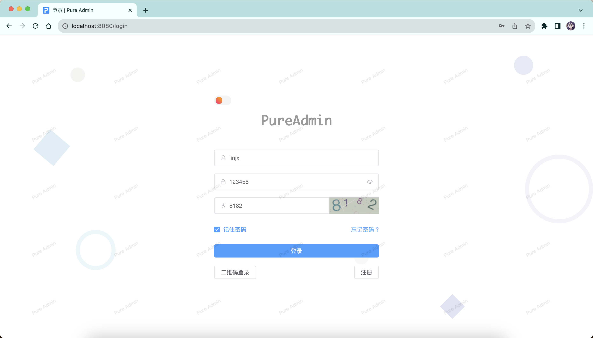
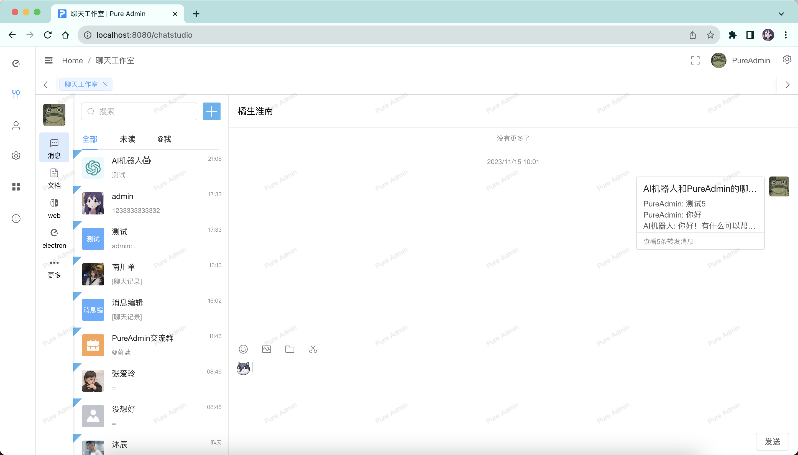
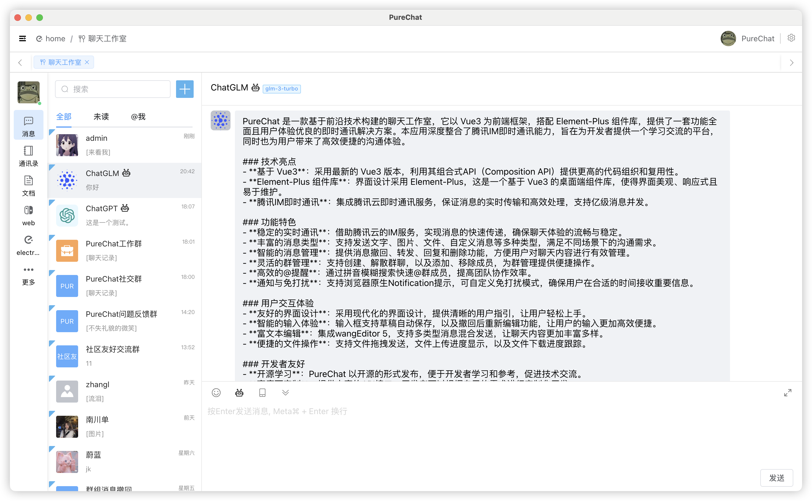
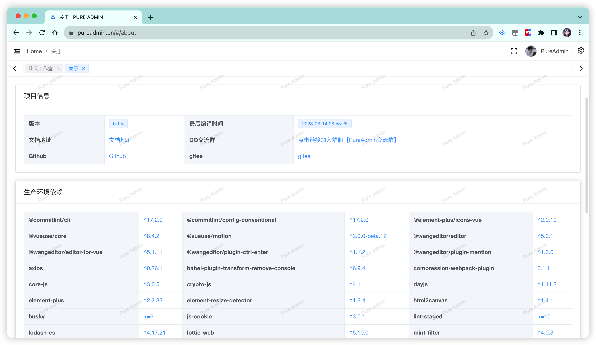

<p align="center">
  <a>
    
  </a>
  <h2 align="center" style="font-weight: 600;font: bold 200% Consolas, Monaco, monospace;color: #999;" >
    PureChat
  </h2>
  <p align="center">
    <span>使用 vue3 + Element-Plus开发 用于学习参考</span>
    <br />
    <a href="https://pureadmin.cn" target="blank">
      <strong>🌎 在线预览</strong>
    </a>
    &nbsp;&nbsp;|&nbsp;&nbsp;
    <a href="https://jq.qq.com/?_wv=1027&k=Cd4Ihd2J" target="blank">
      <strong>💬 联系作者</strong>
    </a>
    <br />
    <br />
  </p>
</p>

[![Web][Web-image]][web-url]
[![Windows][Windows-image]][download-url]
[![MacOS][MacOS-image]][download-url]

[web-url]: https://pureadmin.cn
[download-url]: https://github.com/Hyk260/PureAdmin/releases
[Web-image]: https://img.shields.io/badge/Web-PWA-orange?logo=microsoftedge
[Windows-image]: https://img.shields.io/badge/-Windows-blue?logo=windows
[MacOS-image]: https://img.shields.io/badge/-MacOS-black?logo=apple

[](https://github.com/Hyk260/PureAdmin/blob/master/LICENSE) [](https://github.com/Hyk260/PureAdmin/stargazers) [](https://github.com/Hyk260/PureAdmin/network/members)

## 简介

[反馈](https://github.com/Hyk260/PureAdmin/issues) / [QQ 群](https://github.com/Hyk260/PureAdmin/discussions/2) / [打赏开发者](./images/weix.png) / [文档](https://hyk260.github.io/pure-docs)

[PureChat](https://github.com/Hyk260/PureAdmin) 是一个基于 Vue3、Element-Plus 的清新优雅的聊天工作室(腾讯 IM 即时通讯) 用于学习参考。

### 🎉 特性

- 📦️ 使用 Vue CLI 5 构建
- 📃 RBAC 模型 + JWT 权限控制
- ☁️ 聊天工作室 `基于IM即时通讯sdk`
- 🌚 光明/黑暗 模式主题切换`自动根据系统主题改变`
- ⚡️ 自定义 SVG 图标组件`svg-sprite-loader`
- 🔴 国际化`vue-i18n` 支持 English, 简体中文
- 🔧 Prettier + ESLint 规范
- 💡 Commitlint 提交规范
- ✨ electron 版本 支持 macOS、Windows 双平台
- 🛠 更多特性开发中

环境配置

```
本地环境需要安装 Node.js 16.15+ 和 Git
```

克隆代码

```bash
git clone https://github.com/Hyk260/PureAdmin.git
```

安装依赖

```
yarn install
```

启动项目

```
yarn serve
```

打包

```
yarn build
```

生成文件结构、模块大小以及依赖关系等信息

```
yarn report
```

自动修复一些代码问题，例如缩进、空格、引号等

```
yarn lint
```

### 🖼️ 截图









### 浏览器支持

本地开发推荐使用`Chrome 90+` 浏览器

支持现代浏览器, 不支持 IE
