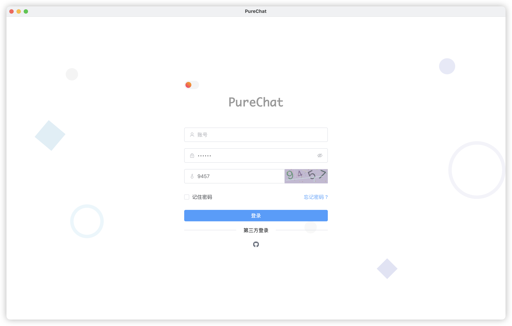
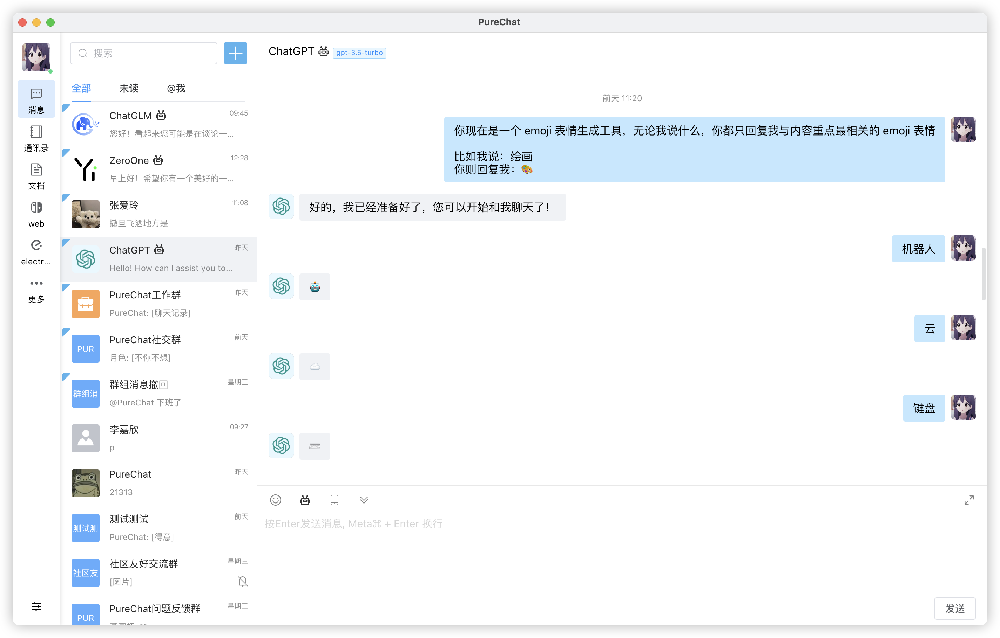

<p align="center">
  <a>
    
  </a>
  <h2 
     align="center" 
     style="font-weight: 600;font: bold 200% Consolas, Monaco, monospace;color: #999;"
     >
    Pure Admin
  </h2>
  <p align="center">
    使用 vue3 + Element-Plus开发 用于学习参考
    <br />
    <a href="https://pureadmin.cn" target="blank">
      <strong>🌎 在线预览</strong>
    </a>
    &nbsp;&nbsp;|&nbsp;&nbsp;
    <a href="https://jq.qq.com/?_wv=1027&k=Cd4Ihd2J" target="blank">
      <strong>💬 联系作者</strong>
    </a> 
    <br />
    <br />
  </p>
</p>

[](https://github.com/Hyk260/PureAdmin/blob/master/LICENSE) [](https://github.com/Hyk260/PureAdmin/stargazers) [](https://github.com/Hyk260/PureAdmin/network/members)

## 简介

[反馈](https://github.com/Hyk260/PureAdmin/issues) / [QQ 群](https://github.com/Hyk260/PureAdmin/discussions/2) / [打赏开发者](./images/weix.png)

[Pure Admin](https://github.com/Hyk260/PureAdmin) 是一个基于 Vue3、Element-Plus 的清新优雅的中后台模版，内置了 i18n 国际化，动态路由，权限验证，提炼了典型的业务模型，提供了丰富的功能组件 聊天工作室 (腾讯 IM 即时通讯) 用于学习参考。

### 🎉 特性

- 📦️ 使用 Vue CLI 5 构建
- 📃 RBAC 模型 + JWT 权限控制

  - 后端路由动态渲染 `express`

- ☁️ 聊天工作室 `基于IM即时通讯sdk`

  - 群聊支持@成员功能
  - 消息免打扰 红点提示 图标高亮闪烁提示(仅 electron 支持)
  - 支持浏览器原生 Notification 提示(点击可定位到指定消息)
  - 富文本框高度可自由上下调整
  - 文本链接识别 (点击跳转新窗口打开)
  - 检查当前网络环境 (断网提示)
  - 聊天消息支持 `撤回` `转发` `回复` `删除` 功能
  - 支持 「创建，解散」群 「添加，移除」成员
  - 支持「文字」「图片」「抖音-QQ 表情包」「文件」「自定义」「链接」等格式消息发送
  - 消息预加载机制 文件上传进度 拖拽发送 另存为
  - 消息输入框使用富文本框 `wangEditor 5`开发(后续支持多类型消息混发)
  - 导航栏支持动态拖拽排序以及自定义编辑
  - 接入 ChatGpt 机器人(暂时只支持单聊)(开发中)
  - 切换会话列表时 输入框草稿保存与回填功能(开发中)

- 🎮 九宫格拼图游戏(完善中)
- 🌚 光明/黑暗 模式切换`自动根据系统主题改变`(完善中)
- ⚡️ 自定义 SVG 图标组件`svg-sprite-loader`
- 🔴 国际化`vue-i18n`(开发中)

  - vscode 扩展插件 `i18n-ally`自动翻译

- ⚙️ vscode 配置文件
  - vue3.0 vue3.2 快速度生成模板语法配置 `code-snippets`
  - vscode 扩展插件推荐 `extensions`
- 🔧Prettier + ESLint 规范 `自动格式化`
- 💡Commitlint 提交规范
- ✨electron 版本 支持 macOS、Windows 双平台
- 🛠 更多特性开发中

### 按需引入 element-plus 组件

全量引入组件库太过臃肿，项目中使用 `unplugin-vue-components` 插件进行按需自动引入组件，

可通过[官方文档](https://element-plus.org/zh-CN/guide/quickstart.html#按需导入)了解更多。

### SVG 图标使用

将 svg 图标文件放在 `src/icons/svg` 目录下

在项目中直接使用 `<svg-icon iconClass="svg图标文件命名" />` 即可

### ✨ 安装使用

本项目由 [node-admin](https://node-admin.cn) 提供 API。本地运行 node-admin，或者将 API [部署至 Vercel](https://vercel.com)

（暂时因密钥安全不能公开 需要测试可以联系我）

环境配置

```
本地环境需要安装 Node.js 14.18+ 和 Git
```

克隆代码

```bash
git clone https://github.com/Hyk260/PureAdmin.git
```

安装依赖

```
yarn install
```

启动项目

```
yarn serve
```

打包

```
yarn build
```

生成文件结构、模块大小以及依赖关系等信息

```
yarn report
```

自动修复一些代码问题，例如缩进、空格、引号等

```
yarn lint
```

### 🎨 目录结构

```
├── .vscode                    // 编辑器配置
├── dist                       // 打包文件
├── locales                    // 国际化语言包
├── node_modules               // 依赖包
├── public                     // 静态目录
├── server                     // 服务器
├── src                        // 源代码
│   ├── api                    // 所有请求
│   ├── assets                 // 主题字体图片svg icons等静态资源
│   ├── components             // 全局公用组件
│   ├── directives             // 自定义指令
│   ├── plugins                // 插件
│   ├── router                 // 路由
│   ├── store                  // 全局 store管理
│   ├── styles                 // 全局样式
│   ├── utils                  // 全局公用方法
│   ├── views                  // view 页面目录
│   ├── App.vue                // 入口页面
│   ├── main.js                // 入口 加载组件 初始化等
├── browserslistrc             // 配置兼容浏览器
├── .eslintignore              // eslint 忽略项
├── .eslintrc.js               // eslint 配置项
├── .env.development           // 开发环境变量
├── .env.production            // 生产环境变量
├── .env.local                 // 本地环境变量
├── .gitignore                 // git 忽略项
├── prettierrc                 // prettier 配置
├── babel.config.js            // babel-loader 配置
├── commitlint.md              // Commitlint 提交规范
├── README.md                  // 说明
├── jsconfig.json              // JavaScript配置
├── LICENSE                    // 开源协议
├── package.json               // 项目名称 项目版本 项目描述 项目运行的一些脚本(依赖)
└── vue.config.js              // vue配置文件
```

### 🖼️ 截图






### 浏览器支持

本地开发推荐使用`Chrome 90+` 浏览器

支持现代浏览器, 不支持 IE
